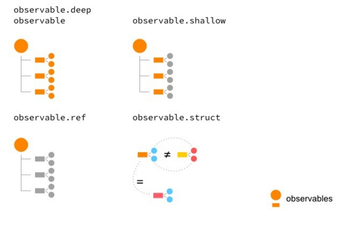

# Notes About MobX

## 1. Introduction

MobX is a reactive state management library.


## 2. Observables, Actions, and Reactions

Observables capture the state of application. Observers (also called reactions) include both the side effect handlers as well as the UI. The actions are that cause a change in the observable state.

`observers -> autorun, reactions, when`

```typescript
import { observable, autorun, action } from 'mobx';

let cart = observable({
	itemCount: 0,
    modified: new Date()
});

autorun(() => {
	console.log(`The Cart contains ${cart.itemCount} item(s).`);
});

const incrementCount = action(() => {
    cart.itemCount++;
});

incrementCount();
```

 `autorun` makes the passed-in function (the tracking-function) an observer of the observables it references.

### 2.1. Observables

An observer can observe one or more observables and get notified when any of them change value.

The simplest way to create an observable is to use the `observable()` function (`observable.object()` when using regular JavaScript):

````typescript
const item = observable({
    name: 'Tükenmez Kalem',
    itemId: '12345',
    quantity: 3,
    price: 33,
    coupon: {
	code: '2020YENIYIL',
	discountPercent: 15
    }
});
````

The `observable()` function automatically converts an object, an array, or a map into an observable entity. This automatic conversion is not applied for other types of data such as JavaScript primitives (number, string, boolean, null, undefined), functions, or for class-instances (objects with prototypes). So, if you call `observable(50)`, it will fail with an error.

We have to use the more specialized `observable.box()` to convert primitive values into an observable. Observables that wrap primitives, functions, or class-instances are called **boxed observables**.

```typescript
const count = observable.box(15);
console.log(`Count is ${count.get()}`); // Get the count
count.set(25); // Change count
```

|                                        |                          |
| -------------------------------------- | ------------------------ |
| objects                                | `observable.object({ })` |
| arrays                                 | `observable.array([ ])`  |
| maps                                   | `observable.map(value)`  |
| primitives, functions, class-instances | `observable.box(value)`  |

#### 2.1.1. Observable arrays

Using `observable.array()` is very similar to using an `observable()`.

The observable array is not a real JavaScript array, even though it has the same API as a JS Array. When you are passing this array to other libraries or APIs, you can convert it into a JS Array by calling `toJS()`:

```Typescript
import { observable, toJS } from 'mobx';

const items = observable.array();
/* Add/remove items*/
const plainArray = toJS(items);
console.log(mobx.isObservableObject(items)); // true
console.log(mobx.isObservableObject(plainArray)); // false
```

#### 2.1.2. Observable maps

You can make an observable map with the `observable.map()` API. Observable maps are great for tracking dynamic changes to the keys and values. This is in stark contrast to observable objects, which do not track properties that are added after creation.

```Typescript
import { observable } from 'mobx';

// Create an Observable Map
const twitterUserMap = observable.map();
console.log(twitterUserMap.size); // Prints: 0

// Add keys
twitterUserMap.set('pavanpodila', 'Pavan Podila');
twitterUserMap.set('mweststrate', 'Michel Weststrate');
console.log(twitterUserMap.get('pavanpodila')); // Prints: Pavan Podila
console.log(twitterUserMap.has('mweststrate')); // Prints: Michel Weststrate

twitterUserMap.forEach((value, key) => console.log(`${key}: ${value}`));
// Prints:
// pavanpodila: Pavan Podila
// mweststrate: Michel Weststrate
```

#### Observability

When you use the `observable()` API, MobX will apply deep observability to the observable instance. This means it will track changes happening to the observable object, array, or map and do it for every property, at every level. In the cases of arrays and maps, it will also track the additions and removals of entries. Any new entry in an array or a map is also made into a deep observable. However, there will be cases where you may not want this default.

You can change this behavior at the time of creating the observable.

```Typescript
observable.object(value, decorators, { deep: false });
observable.map(values, { deep: false });
observable.array(values, { deep: false });
```

For observable objects, MobX only observes the initial set of properties. If the value of property is an object, an array, or a map, it won't do any further observation.

#### The computed observable

A computed property is not an observable that is inherent to the client state. Instead, it is an observable that derives its value from other observables.

`Example:`

> Consider the cart observable, which tracks a list of items:
>
> ```Typescript
> import { observable } from 'mobx';
> 
> const cart = observable.object({
>     items: [],
>     modified: new Date()
> });
> ```
>
> You want to have a description property that describes the cart in this format: There `{is, are} {no, one, n} item{s}` in the cart.
>
> For zero items, the description says this: There are no items in the cart.
>
> When there is only one item, the description becomes this: There is one item in the cart.
>
> For two or more items (n), the description should be: There are n items in the cart.
>
> How we can go about modeling this property. Consider the following:
>
> - Clearly, the description is not an inherent property of the cart. Its value depends on `items.length`.
> - We can add an observable property called `description`, but then we have to update it anytime `items` or `items.length` changes. That is extra work and easy to forget. Also, we run the risk of someone modifying the description from the outside.
> - Description should just be a getter with no setter. If someone is observing description, they should be notified anytime it changes.
>
> What we need here is the computed property. We can define a computed description property by simply adding a `get-property` to the `cart` observable. It will derive its value from `items.length`:
>
> ```Typescript
> const cart = observable.object({
>     items: [],
>     modified: new Date(),
>     get description() {
>         switch (this.items.length) {
>             case 0:
>                 return 'There are no items in the cart';
>             case 1:
>                 return 'There is one item in the cart';
>             default:
>                 return `There are ${this.items.length} items in the cart`;
>         }
>     }
> });
> ```
>
> Now, you can simply read `cart.description` and always get the latest description. Anyone observing this property would be automatically notified when `cart.description` changes, which will happen if you add or remove items from the cart.

Computed properties, also known as **derivations**. Computed properties derive their value from other observables. If any of these depending observables change, the computed property changes as well. You can model a variety of scenarios effortlessly.

You can build a computed property out of other computed properties too. It also caches the value of the computed property to avoid unnecessary computation. Unlike JavaScript get properties, which are always eagerly evaluated, computed properties memoize (cache) the value and only evaluate when the dependent observables change.

##### a. Syntax with Decorators

The decorator syntax is only available for classes and can be used for class declarations,properties and methods.

```Typescript
class Cart {
    @observable.shallow items = [];
    @observable modified = new Date();

    @computed get description() {
		switch (this.items.length) {
			case 0:
				return 'There are no items in the cart';
			case 1:
				return 'There is one item in the cart';
			default:
				return `There are ${this.items.length} items in the cart`;
		}
	}
}
```

> Notice the use of decorators to decorate the observable properties. The default `@observable` decorator does deep observation on all the properties of the value. It is actually a shorthand for using `@observable.deep`. Similarly, we have the `@observable.shallow` decorator, which is a rough equivalent of setting the `{ deep: false }` option on the observable. It works for objects, arrays, and maps.

### 2.2. Actions

Actions introduce vocabulary into the UI and give declarative names to the operations that mutate the state.

```typescript
import { observable, action } from 'mobx';

const cart = observable({
    items: [],
    modified: new Date()
});

// Create the actions
const addItem = action((name, quantity) => {
    const item = cart.items.find(x => x.name === name);
    if (item) {
        item.quantity += 1;
    } else {
        cart.items.push({ name, quantity });
    }
    cart.modified = new Date();
});

const removeItem = action(name => {
    const item = cart.items.find(x => x.name === name);
    if (item) {
        item.quantity -= 1;
        if (item.quantity <= 0) {
            cart.items.remove(item);
        }
        cart.modified = new Date();
    }
});

// Invoke actions
addItem('balloons', 2);
addItem('paint', 2);
removeItem('paint');
```

#### Enforcing the use of actions

This can be made mandatory by configuring MobX to always enforce this policy, also called the strict mode. The `configure()` function can be used to set the `enforceActions` option to true. MobX will now throw an error if you try to modify an observable outside of an action.

If we try to modify it outside an action, MobX will fail with an error:

```typescript
import { observable, configure } from 'mobx';

configure({ enforceActions: true });

// Modifying outside of an action
cart.items.push({
    name: 'test',
    quantity: 1
});
cart.modified = new Date();
-------------------------------------------
Error: [mobx] Since strict-mode is enabled, changing observed observable values outside actions is not allowed. Please wrap the code in an `action` if this change is intended. Tried to modify: ObservableObject@1.items
```

`({ enforceActions: true })` will only throw errors if there are observers watching the observables that you are trying to mutate. If there are no observers for those observables, MobX will safely ignore it. This is because there is no risk of triggering reactions too early. However, if you do want to be strict about this, you can also set `{ enforceActions: 'strict' }`. This will throw an error even if there are no observers attached to the mutating observables.

#### Decorating actions

Actions also get special treatment with the `@action` decorator to mark class methods as actions.

```typescript
class Cart {
    @observable modified = new Date();
    @observable.shallow items = [];
    
    @action
    addItem(name, quantity) {
        this.items.push({ name, quantity });
        this.modified = new Date();
    }
    
    @action.bound
    removeItem(name) {
        const item = this.items.find(x => x.name === name);
        if (item) {
            item.quantity -= 1;
            if (item.quantity <= 0) {
                this.items.remove(item);
            }
        }
    }
}
```

`@action.bound` means you can pass around the reference to `removeItem()` and be assured that the this value always points to the instance of the Cart.

A different way of declaring the `removeItem` action with a pre-bound this is with the use of class properties and arrow-functions:

```typescript
class Cart {
    /* ... */
    @action removeItem = (name) => {
        const item = this.items.find(x => x.name === name);
        if (item) {
            item.quantity -= 1;
            if (item.quantity <= 0) {
                this.items.remove(item);
            }
        }
    }
}
```

### 2.3. Reactions

Reactions are the side-effect causing behaviors that react to the changes in observables. MobX gives you three different ways to express your reactions or side-effects. These are `autorun()`, `reaction()`, and `when()`.

#### 2.3.1. autorun()

`autorun()` is a long-running side-effect that takes in a function (`effect-function`) as its argument. The `effect-function` function is where you apply all your side-effects. Now, these side-effects may depend on one or more observables. MobX will automatically keep track of any change happening to these dependent observables and re-execute this function to apply the side-effect.

```typescript
import { observable, action, autorun } from 'mobx';

class Cart {
    @observable modified = new Date();
    @observable.shallow items = [];
    constructor() {
        autorun(() => {
            console.log(`Items in Cart: ${this.items.length}`);
        });
    }
    
    @action addItem(name, quantity) {
        this.items.push({ name, quantity });
        this.modified = new Date();
    }
}

const cart = new Cart();
cart.addItem('Power Cable', 1);
cart.addItem('Shoes', 1);
// Prints:
// Items in Cart: 0
// Items in Cart: 1
// Items in Cart: 2
```

`autorun()` runs immediately and also on every change to the dependent observables. How do you actually stop it? Well, the return-value of `autorun()` is a function that is in fact a disposer-function. By calling it, you can cancel the `autorun()` side-effect.

```typescript
import { observable, action, autorun } from 'mobx';

class Cart {
    /* ... */
    cancelAutorun = null;
    constructor() {
        this.cancelAutorun = autorun(() => {
            console.log(`Items in Cart: ${this.items.length}`);
        });
    }
    /* ... */
}

const cart = new Cart();
// 1. Cancel the autorun side-effect
cart.cancelAutorun();

// 2. The following will not cause any logging to happen
cart.addItem('Power Cable', 1);
cart.addItem('Shoes', 1);

// Prints:
// Items in Cart: 0
```

#### 2.3.2. reaction()

`reaction()` is similar to `autorun()` but waits for a change in the observables before executing the effect-function. `reaction()` in fact takes two arguments:

```typescript
reaction(tracker-function, effect-function): disposer-function
tracker-function: () => data, effect-function: (data) => {}
```

`tracker-function` is where all the observables are tracked. Any time the tracked observables change, it will re-execute. It is supposed to return a value that is used to compare it to the previous run of `tracker-function`. If these return-values differ, the `effect-function` is executed.

By breaking up the activity of a reaction into a change-detecting function (`tracker` function) and the effect function, `reaction()` gives us more fine-grained control over when a side-effect should be caused. It is no longer just dependent on the observables it is tracking inside the `tracker` function. Instead, it now depends on the data returned by the tracker function. The `effect` function receives this data in its input. Any observables used in the effect function are not tracked.

Just like `autorun()`, you also get a disposer function as the return-value of `reaction()`. This can be used to cancel the side-effect anytime you want.

`Example:`

> You want to be notified anytime an item in your `Cart` changes its price. After all, you don't want to purchase something that suddenly shoots up in price. At the same time, you don't want to miss out on a great deal as well. So,getting a notification when the price changes is a useful thing to have. We can implement this by using `reaction()`, as shown here:
>
> ```typescript
> import { observable, action, reaction } from 'mobx';
> 
> class Cart {
>     @observable modified = new Date();
>     @observable items = [];
>     
>     cancelPriceTracker = null;    
>     trackPriceChangeForItem(name) {
>         if (this.cancelPriceTracker) {
>             this.cancelPriceTracker();
>         }
>         
>         // 1. Reaction to track price changes
>         this.cancelPriceTracker = reaction(
>             () => {
>                 const item = this.items.find(x => x.name === name);
>                 return item ? item.price : null;
>             },
>             price => {
>                 console.log(`Price changed for ${name}: ${price !== null ? price : 0}`);
>             }
>         );
>     }
>     
>     @action addItem = (name, price) => {
>         this.items.push({ name, price });
>         this.modified = new Date();
>     }
>     
>     @action changePrice = (name, price) => {
>         const item = this.items.find(x => x.name === name);
>         if (item) {
>             item.price = price;
>         }
>     }
> }
> 
> const cart = new Cart();
> cart.addItem('Shoes', 20);
> 
> // 2. Now track price for "Shoes"
> cart.trackPriceChangeForItem('Shoes');
> 
> // 3. Change the price
> cart.changePrice('Shoes', 100);
> cart.changePrice('Shoes', 50);
> 
> // Prints:
> // Price changed for Shoes: 100
> // Price changed for Shoes: 50
> ```
>
> We are setting up a price tracker in comment 1, as a reaction to track price changes. Notice that it takes two functions as inputs. The first function (`tracker-function`) finds the item with the given `name` and returns its price as the output of the `tracker` function. Anytime it changes, the corresponding `effect` function is executed.

#### 2.3.3. when()

`when()` only executes the `effect-function` when a condition is met and automatically disposes the side-effect after that. Thus, `when()` is a one-time side-effect compared to `autorun()` and `reaction()`, which are long-running. The predicate function normally relies on some observables to do the conditional checks. If the observables change, the predicate function will be re-evaluated. `when()` takes two arguments:

```typescript
when(predicate-function, effect-function): disposer-function
predicate-function: () => boolean, effect-function: ()=>{}
```

The `predicate` function is expected to return a Boolean value. When it becomes `true`, the `effect` function is executed, and the `when()` is automatically disposed. `when()` also gives you back a `disposer` function that you can call to prematurely cancel the side-effect.

`Example:`

> We are monitoring the availability of an item and notifying the user when it is back in stock. This is the case of a one-time effect that you don't really have to continuously monitor. It's only when the item count in the inventory goes above zero, that you execute the side-effect of notifying the user:
>
> ```typescript
> import { observable, action, when } from 'mobx';
> 
> class Inventory {
>     @observable items = [];
>     cancelTracker = null;
>     trackAvailability(name) {
>         // 1. Establish the tracker with when
>         this.cancelTracker = when(
>             () => {
>                 const item = this.items.find(x => x.name === name);
>                 return item ? item.quantity > 0 : false;
>             },
>             () => {
>                 console.log(`${name} is now available`);
>             }
>         );
>     }
>     
>     @action
>     addItem(name, quantity) {
>         const item = this.items.find(x => x.name === name);
>         if (item) {
>             item.quantity += quantity;
>         } else {
>             this.items.push({ name, quantity });
>         }
>     }
> }
> 
> const inventory = new Inventory();
> inventory.addItem('Shoes', 0);
> inventory.trackAvailability('Shoes');
> 
> // 2. Add two pairs
> inventory.addItem('Shoes', 2);
> 
> // 3. Add one more pair
> inventory.addItem('Shoes', 1);
> 
> // Prints:
> // Shoes is now available
> ```
>
> `when()` here takes two arguments. The `predicate` function returns true when the `item.quantity` is greater than zero. The effect function simply notifies (via `console.log`) that the item is available in the store. When the predicate becomes true, `when()` executes the side-effect and automatically disposes itself. Thus, when we add two pairs of shoes into the inventory, `when()` executes and logs the availability.
>
> Notice that when we add one more pair of shoes into the inventory, no logs are printed. This is because at this time `when()` has been disposed and is no longer monitoring the availability of Shoes. This is the one-time effect of `when()`.

#### when() with promise

There is a special version of `when()`, which takes only one argument (the `predicate` function), and gives back a promise instead of the `disposer` function. This is a nice trick where you can skip using the effect function and instead wait for `when()` to resolve before executing the effect.

```typescript
class Inventory {
    /* ... */
    async trackAvailability(name) {
        // 1. Wait for availability
        await when(() => {
            const item = this.items.find(x => x.name === name);
            return item ? item.quantity > 0 : false;
        });
        // 2. Execute side-effect
        console.log(`${name} is now available`);
    }
    /* ... */
}
```

In comment 1, we are waiting for the availability of the item using `when()` that only takes the `predicate` function. By using the `async-await` operators to wait for the promise, we get clean, readable code. Any code that follows the `await` statement is automatically scheduled to execute after the promise resolves. This is a nicer form of using `when()` if you prefer not to pass an effect callback.

`when()` is also very efficient and does not poll the `predicate` function to check for changes. Instead, it relies on the MobX reactivity system to re-evaluate the `predicate` function, when the underlying observables change.

### Quick recap on reactions

We have three ways of running side-effects:

1. `autorun( effect-function: () => {} )`: Useful for long-running side-effects. The effect function executes immediately and also anytime the dependent observables (used within it) change. It returns a disposer function that can be used to cancel anytime.
2. `reaction( tracker-function: () => data, effect-function: (data) => {} )`: Also for long-running side-effects. It executes the `effect` function only when the data returned by the `tracker` function is different. In other words, `reaction()` waits for a change in the observables before any side-effects are run. It also gives back a `disposer` function to cancel the effect prematurely.
3. `when( predicate-function: () => boolean, effect-function: () => {} )`: Useful for one-off effects. The `predicate` function is evaluated anytime its dependent observables change. It executes the `effect` function only when the `predicate` function returns `true`. `when()` automatically disposes itself after running the effect function. There is a special form of `when()` that only takes in the `predicate` function and returns a promise. Use it with `async-await` for a simpler `when()`.

## 3. Observable State and Actions

Since data (aka state) is so central to a UI, it makes sense we start first by modeling this state. With MobX, observables represent that state. Looking back at the UI design from before, we can identify various parts of the observable state:

- There is the search-text that the user types. This is an `observable` field of type string.
- There is an observable array of results.
- There is meta information about the results, such as the current subset and the total result count.
- There is some state to capture the `async search()` operation that we will be invoking. The initial `status` of the operation is `empty`. Once the user invokes the search, we are in the `pending` state. When the search completes, we could either be in the `completed` or `failed` state. This looks more like an enumeration of `<empty>, pending, completed`, or `failed`, and can be captured with an `observable` field.

Since all of these state properties are related, we could put them under one observable object:

```typescript
const searchState = observable({
    term: '',
    state: '',
    results: [],
    totalCount: 0
});
```

Besides the state, we also need to identify the operations that can be performed on the UI. For our simple UI, this includes invoking the search and updating the term as the user types characters into the text box. Operations in MobX are modeled as actions, which internally mutate the observable state. We can add these as actions on the `searchState` observable:

```typescript
const searchState = observable({
    term: '',
    status: '',
    results: [],
    totalCount: 0,
    search: action(function() {
        // invoke search API
    }),
    setTerm: action(function(value) {
        this.term = value;
    })
});
```

The `searchState` observable is slowly growing in size and also accumulating some syntactic-noise in defining the observable state. As we add more observable fields, computed properties and actions, this can definitely become more unwieldy. A better way to model this is to use classes and decorators.

Let's see how this looks with classes and decorators:

```typescript
class BookSearchStore {
    @observable term = '';
    @observable status = '';
    @observable.shallow results = [];
    @observable totalCount = 0;

    @action.bound
    setTerm(value) {
        this.term = value;
    }
    
    @action.bound
    async search() {
        // invoke search API
    }
}

export const store = new BookSearchStore();
```

The use of decorators makes it easy to see the observable fields of the class. In fact, we have the flexibility to mix and match observable fields with regular fields. Decorators also make it easy to tweak the level of observability (for example: a `shallow` observable for the results). The `BookSearchStore` class captures the observable fields and actions with the help of decorators. Since we only need one instance of this class, we are exporting the singleton-instance as `store`.

### Managing the async Action

```typescript
class BookSearchStore {
    @observable term = '';
    @observable status = '';
    @observable.shallow results = [];
    @observable totalCount = 0;
    /* ... */
    @action.bound
    async search() {
        try {
            this.status = 'pending';
            const result = await searchBooks(this.term);
            runInAction(() => {
                this.totalCount = result.total;
                this.results = result.items;
                this.status = 'completed';
            });
        } catch (e) {
            runInAction(() => (this.status = 'failed'));
            console.log(e);
        }
    }
}
```

- `async` actions are not very different from `sync` actions. In fact, an async-action is just sync-actions at different points in time.
- Setting the observable state is just a matter of assignment. We wrap the code after `await` in a `runInAction()` to ensure all observables are mutated inside an action. This becomes key when we turn on the `enforceActions` configuration for MobX.
- Because we are using `async-await`, we are handling the two future possibilities in one place.
- The `searchBooks()` function is just a service-method that makes the call to the Goodreads API and fetches the results. It returns a promise, which we `await` inside the `async` action.

One observation you can make in the `async search()` method just seen is the wrapping of the state mutation in `runInAction()`. This can get tedious if you have multiple `await` calls with state mutation in between those calls. Diligently wrapping each of those state-mutations can be cumbersome and you may even forget to wrap! To avoid this unwieldy ceremony, you could use a utility function called `flow()`, which takes in a `generator` function and, instead of `await`, uses the `yield` operator. The `flow()` utility correctly wraps the state-mutations following a `yield` within `action()`, so you don't have to do it yourself.

### The Reactive UI

`observer()` is a binding library for MobX and React. It creates a higher-order-component (HOC) that wraps a React component to automatically update on changes to the observable state. Internally, `observer()` keeps track of observables that are dereferenced in the `render` method of the component. When any of them change, a re-render of the component is triggered.

```typescript
import {inject, observer} from 'mobx-react';

@inject('store')
@observer
class App extends React.Component {
    render() {
        const { store } = this.props;
        return (
            <Fragment>
            	<Header />
            	<Grid container>
            		<Grid item xs={12}>
            			<Paper elevation={2} style={{ padding: '1rem' }}>
                			<SearchTextField
							onChange={this.updateSearchText}
							onEnter={store.search}
							/>
						</Paper>
					</Grid>
					<ResultsList style={{ marginTop: '2rem' }} />
				</Grid>
			</Fragment>
		);
	}

	updateSearchText = event => {
        this.props.store.setTerm(event.target.value);
    };
}
```

`inject('store')`, creates a HOC that binds the `store` observable to the React component. This means that, inside the `render()` of the App component, we can expect a `store` property to be available on the props.

#### Getting to the store

Using `inject()`, you can connect the observable `BookSearchStore` to any of your React components. How does `inject()` know about `BookSearchStore`?

```typescript
import { store } from './BookStore';
import React, { Fragment } from 'react';
import ReactDOM from 'react-dom';
import { Provider } from 'mobx-react';

ReactDOM.render(
    <Provider store={store}>
    	<App />
    </Provider>,
	document.getElementById('root')
);
```

The `Provider` component from `mobx-react` establishes the real connecting glue with the `BookSearchStore` observable. The exported singleton instance of `BookSearchStore` (named `store`),is passed as a prop named `store` `Provider`. Internally, it uses the React Context to propagate the `store` to any component wrapped by the `inject()` decorator. Thus, the `Provider` provides the `store` observable and `inject()` connects to React Context (exposed by `Provider`),and injects the `store` into the wrapped component.

The `Provider` is literally the provider of the observable state. It relies on the React Context to propagate the `store` observable in the component sub-tree. By decorating components with `inject()` and `observer()`, you can connect to the observable state and react to changes.

With the introduction of `React.createContext()` in React 16.3+, you can create your own Provider component.

## 4. The Shape of Data

There are two distinct ways in which you can control observability:

- By using the various `@decorators` inside classes
- By using the `decorate()` API

### 4.1. Using @decorators

Decorators are a syntactic feature that allow you to attach behavior to a class and its fields.

#### 4.1.1. Creating shallow observables with @observable.shallow

This decorator prunes the observability to just the first level of the data, also called **one-level-deep** observation, and is particularly useful for observable arrays and maps. In the case of arrays, it will monitor a reference change (for example, assigning a new array) of the array itself, and the addition and removal of items in the array. If you have items in the array that have properties, they would not be considered in the shallow observation. Similarly, for maps,only the addition and removal of keys is considered, along with the reference change of the map itself. Values of the keys in the observable map are left as-is and not considered for observation.

```typescript
class BookSearchStore {
    @observable term = 'javascript';
    @observable status = '';
    @observable.shallow results = [];
    @observable totalCount = 0;
}
```

We chose to apply this decorator to the `results` property of the `BookSearchStore`. It is clear that that we are not particularly observing the properties of each individual result. In fact, they are read only objects that will never change values, so it makes sense that we prune the observability to just the addition and removal of items, and reference changes in the `results` array. Thus, `observable.shallow` is the right choice here.

#### 4.1.2. Creating reference-only observables with @observable.ref

If you are not interested in any changes happening inside a data structure (object, array, map)and only in the change in value, `@observable.ref` is what you are looking for. It will only monitor reference changes to the observable.

```typescript
import { observable, action } from 'mobx';

class FormData {
    @observable.ref validations = null;
    @observable username = '';
    @observable password = '';
    
    @action
    validate() {
        const { username, password } = this;
        this.validations = applyValidations({ username, password });
    }
}
```

The `validations` observable is always assigned a new value. Since we are never modifying the properties of this object, it is better to mark it as `@observable.ref`. This way, we only track reference changes to `validations` and nothing else.

#### 4.1.3. Creating structural observables with @observable.struct

MobX has a built-in behavior to track changes in values and works well for primitives like strings, numbers, booleans, and so on. However, it becomes less than ideal when dealing with objects. Every time a new object is assigned to the observable, it will be considered as a change, and reactions will fire. What you really need is a structural check where the properties of your object are compared instead of the object reference, and then decide if there is a change. That is the purpose of `@observable.struct`.

It does a deep comparison based on property values rather then relying on the top-level reference. You can think of this as a refinement over the `observable.ref` decorator.

```typescript
class Sphere {
    @observable.struct location = { x: 0, y: 0 };
    
    constructor() {
        autorun(() => {
            console.log(`Current location: (${this.location.x}, ${this.location.y})`);
        });
    }
    
    @action
    moveTo(x, y) {
        this.location = { x, y };
    }
}

let x = new Sphere();
x.moveTo(0, 0);
x.moveTo(20, 30);

// Prints
// Current location: (0, 0)
// Current location: (20, 30)
```



## 5. Derivations, Actions, and Reactions

### flow()

Wrapping the state-mutations in `runInAction()` after each `await` can quickly turn cumbersome. You can even forget wrapping some parts if there are more conditionals involved or if the mutations are spread across multiple functions. Instead of `await`, you use the `yield` operator instead.

```typescript
import { observable, action, flow, configure } from 'mobx';

configure({ enforceActions: 'strict' });

class AuthStore {
    @observable loginState = '';
    login = flow(function*(username, password) {
        this.loginState = 'pending';
        yield this.initializeEnvironment();
        this.loginState = 'initialized';
        yield this.serverLogin(username, password);
        this.loginState = 'completed';
        yield this.sendAnalytics();
        this.loginState = 'reported';
        yield this.delay(3000);
    });
}
new AuthStore().login();
```

Notice the use of the generator `function*()` instead of the regular function, which is passed as argument to `flow()`.

`cancel()` is useful for canceling a long-running operation by giving user-level control.

### Options for autorun()

The second argument to `autorun()` is an object that carries the options:

```typescript
autorun(() => { /* side effects */}, options)
```

It has the following properties:

- `name`: This is useful for debugging purposes
- `delay`: This acts as a debouncer for frequently changing observables. The effect-function will wait for the `delay` period (specified in milliseconds) before re-executing.
- `onError`: Errors thrown during the execution of the effect-function can be safely handled by providing the `onError` handler.

### Options for reaction()

```typescript
reaction(() => {/* tracking data */}, (data) => { /* side effects */}, options)
```

Some of the options, as shown below, are exactly like `autorun`, which keeps it consistent:

- `name`
- `delay`
- `onError`

 There are additional options, specifically for `reaction()`:

- `fireImmediately`: This is a boolean value that indicates whether the effect-function should be triggered immediately after the first invocation of the tracking-function.
- `equals`: Notice that the tracking-function in a `reaction()` gives back `data` that is used to compare with the previously produced value.

## 6. Special API for Special Cases

### Granular Reads and Writes

- `get(thing, key)`: Retrieves the value under the key. This key can even be non-existent. When used in a reaction, it will trigger a re-execution when that key becomes available.
- `set(thing, key, value)` or `set(thing, { key: value })`: sets a value for the key. The second form is better for setting multiple key-value pairs at once. Conceptually, it is very similar `toObject.assign()`, but with the addition of being reactive. 
- `has(thing, key)`: Gives back a boolean indicating if the key is present.
- `remove(thing, key)`: Removes the given key and its value.
- `values(thing)`: Gives an array of values.
- `keys(thing)`: Gives an array containing all the keys. Note that this only applies to observable objects and maps.
- `entries(thing)`: Gives back an array of key-value pairs, where each pair is an array of two elements (`[key, value]`).

### From MobX to JavaScript

When interfacing with external libraries, you may need to send the raw JavaScript values instead of the MobX-typed values. This is where you need the `toJS()` function. It will convert the MobX observables to raw JavaScript values: `toJS(source, options?)`

- `source`: Any observable box, object, array, map, or primitives.
- `options`: An optional argument to control behavior, such as:
  - `exportMapsAsObject` (boolean): Whether to serialize the observable maps as objects (when `true`) or as JavaScript Maps (when `false`). Default is `true`.
  - `detectCycles` (boolean): This is set to `true` by default. It detects cyclic references during serialization and reuses the already serialized object. This is a good default in most cases,but for performance reasons this can be set to `false` when you are sure of no cyclic references.

### Hooking Into the Observability

What we need here is the ability to know when an observable becomes observed and when it becomes unobserved: the two points in time where it becomes active and inactive in the MobX reactive system. For that, we have the following aptly named APIs:

```typescript
disposer = onBecomeObserved(observable, property?: string, listener: () => void)
disposer = onBecomeUnobserved(observable, property?: string, listener: () => void)
```

- `observable`: Can be a boxed observable, an observable object/array/map.
- `property`: An optional property of the observable. Specifying a property is fundamentally different than referencing the property directly.
- `disposer`: The return value of these handlers. This is a function that can be used to dispose these handlers and clean up the event wiring.

`Example`:

> We will lazy load the temperature for a city, but only when it is accessed. This can be done by modeling the observable property with the hooks for `onBecomeObserved()` and `onBecomeUnobserved()`.
>
> ```typescript
> // A mock service to simulate a network call to a weather API
> const temperatureService = {
>     fetch(location) {
>         console.log('Invoked temperature-fetch');
>         return new Promise(resolve =>
> 			setTimeout(resolve(Math.round(Math.random() * 35)), 200);
>         );
>     }
> };
> 
> class City {
>     @observable temperature;
>     @observable location;
>     interval;
>     disposers;
>     
>     constructor(location) {
>         this.location = location;
>         const disposer1 = onBecomeObserved(
>             this,
>             'temperature',
>             this.onActivated
>         );
>         const disposer2 = onBecomeUnobserved(
>             this,
>             'temperature',
>             this.onDeactivated
>         );
>         this.disposers = [disposer1, disposer2];
>     }
>     
>     onActivated = () => {
>         this.interval = setInterval(() => this.fetchTemperature(), 5000);        
>         console.log('Temperature activated');
>     };
>     
>     onDeactivated = () => {
>         console.log('Temperature deactivated');
>         this.temperature = undefined;
>         clearInterval(this.interval);
>     };
>     
>     fetchTemperature = flow(function*() {
>         this.temperature = yield temperatureService.fetch(this.location);
>     });
>     
>     cleanup() {
>         this.disposers.forEach(disposer => disposer());
>         this.disposers = undefined;
>     }
> }
> 
> const city = new City('Bengaluru');
> const disposer = autorun(() =>    
> 	console.log(`Temperature in ${city.location} is ${city.temperature}ºC`)
> );
> setTimeout(disposer, 15000);
> ```
>
> The preceding console output shows you the activation and deactivation for the `temperature` observable. It is activated in `autorun()` and after 15 seconds, it gets deactivated. We kick off the timer that keeps updating the temperature in the `onBecomeObserved()` handler and clear it in the `onBecomeUnobserved()` handler. The timer is the resource we manage that is created only when the `temperature` is accessed and not before:
>
> ```
> Temperature activated
> Temperature in Bengaluru is undefinedºC
> 
> Invoked temperature-fetch
> Temperature in Bengaluru is 22ºC
> Invoked temperature-fetch
> Temperature in Bengaluru is 32ºC
> Invoked temperature-fetch
> Temperature in Bengaluru is 4ºC
> 
> Temperature deactivated
> ```

### Gatekeeper of Changes

The changes you make to an observable are not applied immediately by MobX. Instead, they go through a layer of interceptors that have the ability to keep the change, modify it, or even discard it completely. This is all possible with the `intercept()` API. The signature is very similar to `onBecomeObserved` and `onBecomeUnobserved`, with the callback function (interceptor) giving you the change object:

```typescript
disposer = intercept(observable, property?, interceptor: (change) => change | null )
```

- `observable`: A boxed observable or an observable object/array/map.
- `property`: The optional string name of the property you want to intercept on the observable. As we saw earlier for `onBecomeObserved` and `onBecomeUnobserved`, there is a difference between `intercept(cart, 'totalPrice', (change) => {})` and `intercept(cart.totalPrice, () => {})`.
- `interceptor`: A callback that receives the change object and is expected to return the final change; apply as-is, modify, or discard (`null`). It is also valid to throw an error in the interceptor to notify exceptional updates.
- `disposer`: Gives back a function, which when called will cancel this interceptor. This is very similar to what we have seen with `onBecomeObserved()`, `onBecomeUnobserved()`, and even reactions like `autorun()`, `reaction()`, and `when()`.

### Intercepting the Change

The change argument that is received has some known fields that give the details. The most important of these are the `type` field, which tells you the type of change, and `object`, which gives the object on which the change happened. Depending upon the `type`, a few other fields add more context to the change:

- `type`: Can be one of add, delete, or update
- `object`: A boxed observable or the observable object/array/map instance
- `newValue`: When the type is add or update, this fields contains the new value
- `oldValue`: When the type is delete or update, this field carries the previous value

Inside the interceptor callback, you have the opportunity to finalize the type of change you actually want to apply. You can do one of the following:

- Return null and discard the change
- Update with a different value
- Throw an error indicating an exceptional value
- Return as-is and apply the change

`Example`:

> Intercepting the theme changes and ensuring that only valid updates are applied. In the following snippet, you can see how we intercept the color property of the theme observable. The color can either be light or dark, or have a shorthand value of l or d. For any other value, we throw an error. We also guard against unsetting the color by returning `null` and discarding the change:
>
> ```typescript
> import { intercept, observable } from 'mobx';
> 
> const theme = observable({
>     color: 'light',
>     shades: []
> });
> 
> const disposer = intercept(theme, 'color', change => {
>     console.log('Intercepting:', change);
>     
>     // Cannot unset value, so discard this change
>     if (!change.newValue) {
>         return null;
>     }
>     
>     // Handle shorthand values
>     const newTheme = change.newValue.toLowerCase();
>     if (newTheme === 'l' || newTheme === 'd') {
>         change.newValue = newTheme === 'l' ? 'light' : 'dark'; // set the correct value
>         return change;
>     }
>     
>     // check for a valid theme
>     const allowedThemes = ['light', 'dark'];
>     const isAllowed = allowedThemes.includes(newTheme);
>     if (!isAllowed) {
>         throw new Error(`${change.newValue} is not a valid theme`);
>     }
>     return change; // Correct value so return as-is
> });
> ```

### observe() the Changes

The utility that acts as the counterpart of `intercept()` is `observe()`. `observe()`, as the name suggests, allows you to make granular observations on observables:

```typescript
observe(observable, property?, observer: (change) => {})
```

The signature is exactly like `intercept()`, but the behavior is quite different. `observe()` is invoked after the change has been applied to the observable.

An interesting characteristic is that `observe()` is immune to transactions. What this means is that the observer callback is invoked immediately after a mutation and does not wait until the transaction completes. As you are aware, actions are the places where a mutation happens. MobX optimizes the notifications by firing them, but only after the top-most action completes. With `observe()`, you get an unfiltered view of the mutations as and when they happen.

```typescript
import { observe, observable } from 'mobx';

const theme = observable({
    color: 'light',
    shades: []
});

const disposer = observe(theme, 'color', change => {
    console.log(
        `Observing ${change.type}`,
        change.oldValue,
        '-->',
        change.newValue,
        'on',
        change.object
    );
});

theme.color = 'dark';
```

### Using spy() to Track the Reactivity

Earlier, we saw the `observe()` function, which allows you to "observe" the changes happening to a single observable. But what if you wanted to observe changes happening across all observables without having to individually set up the `observe()` handlers? That is where `spy()` comes in. It gives you insight into how the various observables in your system are changing over time:

```typescript
disposer = spy(listener: (event) => { })
```

It takes in a listener function that receives an event object carrying all the details. The event has properties very similar to the `observe()` handler. There is a `type` field that tells you about the type of the event. The type can be one of:

- `update`: For object, array, map
- `add`: For object, array, map
- `delete`: For map
- `create`: For boxed observables
- `action`: When an action fires
- `reaction`: Upon execution of `autorun()`, `reaction()`, or `when()`
- `compute`: For computed properties
- `error`: In case of any caught exceptions inside actions or reactions 

### Tracing a Reaction

While `spy()` gives you a lens to observe all changes happening in MobX, `trace()` is a utility that is specifically focused on computed properties, reactions, and component renders. You can find out why a computed property, reaction, or a component render is being invoked by simply placing a `trace()` statement inside it:

```typescript
trace(thing?, property?, enterDebugger?)
```

It has three optional arguments:

- `thing`: An observable
- `property`: An observable property
- `enterDebugger`: A Boolean flag indicating whether you want to step into the debugger automatically

It is quite common to invoke a trace with: `trace(true)`, which will pause inside the debugger upon invocation:

```typescript
import { trace } from 'mobx';

@inject('store')
@observer
export class SearchTextField extends React.Component {
    render() {
        trace(true);
        /* ... */
    }
}
```

## 7. The Utility Functions of mobx-utils

In the rest of this section, we will focus on some utilities that are frequently used. These include the following:

- `fromPromise()`
- `lazyObservable()`
- `fromResource()`
- `now()`
- `createViewModel()`

### 7.1. Visualizing async-operations withfromPromise()

Promises are great for dealing with asynchronous operations. When representing the state of operations on the React UI, we have to ensure each of the three states of a promise is handled. This includes the state when the promise is `pending` (operation in progress), `fulfilled` (operation completed successfully), or `rejected` (in case of failures). `fromPromise()` is a convenient way to handle a promise, and gives a nice API to visually represent the three states:

```typescript
newPromise = fromPromise(promiseLike)
```

- `promiseLike`: instance of `Promise` or `(resolve, reject) => { }`
- `fromPromise()` wraps the given promise and gives back a new, MobX-charged promise with some additional observable properties:
  - `state`: One of the three string values: `pending`, `fulfilled`, or `rejected`: These are also available as constants on the `mobx-utils` package: `mobxUtils.PENDING`, `mobxUtils.FULFILLED`, and `mobxUtils.REJECTED`.
  - `value`: The resolved `value` or the `rejected` error. Use state to distinguish the value.
  - `case({pending, fulfilled, rejected})`: This is used to provide the React components for the three states.

```typescript
import { fromPromise, PENDING, FULFILLED, REJECTED } from 'mobx-utils';

class Worker {
    operation = null;
    start() {
        this.operation = fromPromise(this.performOperation());
    }
    performOperation() {
        return new Promise((resolve, reject) => {
            const timeoutId = setTimeout(() => {
                clearTimeout(timeoutId);
                Math.random() > 0.25 ? resolve('200 OK') : reject(new Error('500 FAIL'));
            }, 1000);
        });
    }
}
//--------------------------------------------------------------------------------
import { fromPromise, PENDING, FULFILLED, REJECTED } from 'mobx-utils';
import { observer } from 'mobx-react';
import React, { Fragment } from 'react';
import { CircularProgress, Typography } from '@material-ui/core/es/index';

@observer
export class FromPromiseExample extends React.Component {
    worker;
    constructor(props) {
        super(props);
        this.worker = new Worker();
        this.worker.start();
    }
    render() {
        const { operation } = this.worker;
        return operation.case({
			[PENDING]: () => (
				<Fragment>
					<CircularProgress size={50} color={'primary'} />
					<Typography variant={'title'}>
						Operation in Progress
					</Typography>
				</Fragment>
			),
             [FULFILLED]: value => (
                 <Typography variant={'title'} color={'primary'}>
                 	Operation completed with result: {value}
				</Typography>
			),
             [REJECTED]: error => (
                 <Typography variant={'title'} color={'error'}>
                 	Operation failed with error: {error.message}
				</Typography>
			)
		});
	}
}
```

### 7.2. Using lazyObservable() for Deferred Updates

For operations that are expensive to perform, it makes sense to defer them until needed. With `lazyObservable()`, you can track the result of these operations and update only when needed. It takes in a function that performs the computation and pushes values when ready:

```typescript
result = lazyObservable(sink => { }, initialValue)
```

Here, `sink` is the callback to be invoked to push the value onto `lazyObservable`. The lazy-observable can also start with some `initialValue`.

The current value of `lazyObservable()` can be retrieved using `result.current()`. Once a lazy-observable has been updated, `result.current()` will have some value. To update the lazy-observable again, you can use `result.refresh()`. This will re-invoke the computation and eventually push new values via the `sink` callback. Note that the `sink` callback can be invoked as many times as needed. `lazyObservable()` to update the value of the operation:

```typescript
import { lazyObservable } from 'mobx-utils';

class ExpensiveWorker {
    operation = null;
    constructor() {
        this.operation = lazyObservable(async sink => {
            sink(null); // push an empty value before the update
            const result = await this.performOperation();
            sink(result);
        });
    }
    performOperation() {
        return new Promise(resolve => {
            const timeoutId = setTimeout(() => {
                clearTimeout(timeoutId);
                resolve('200 OK');
            }, 1000);
        });
    }
}
```

To use the lazy-observable inside a React component (an observer), we rely on the `current()` method to fetch its value. MobX will track this value and re-render the component whenever it changes. Notice in the `onClick` handler of the button, we are causing an update of the lazy-observable by calling its `refresh()` method:

```typescript
import { observer } from 'mobx-react';
import React, { Fragment } from 'react';
import { Button, CircularProgress, Typography } from '@material-ui/core/es/index';

@observer
export class LazyObservableExample extends React.Component {
    worker;
    constructor(props) {
        super(props);
        this.worker = new ExpensiveWorker();
    }
    render() {
        const { operation } = this.worker;
        const result = operation.current();
        if (!result) {
            return (
                <Fragment>
                	<CircularProgress size={50} color={'primary'} />
                	<Typography variant={'title'}>
                        Operation in Progress
        			</Typography>
        		</Fragment>
        	);
    	}
    return (
    	<Fragment>
         	<Typography variant={'title'} color={'primary'}>
    			Operation completed with result: {result}
			</Typography>
			<Button
				variant={'raised'}
				color={'primary'}
				onClick={() => operation.refresh()}
			>
                Redo Operation
			</Button>
		</Fragment>
	);
}
```

### 7.3. A Generalized lazyObservable() with fromResource()

There is also a more generalized form of ``lazyObservable()` called `fromResource()`. Similar to `lazyResource()`, it takes in a function with the `sink` callback. This acts as a subscribing function,which is invoked only when the resource is actually requested. Additionally, it takes a second argument, an unsubscribing function, which can be used to clean up when the resource is no longer needed:

```typescript
resource = fromResource(subscriber: sink => {}, unsubscriber: () => {}, initialValue)
```

`fromResource()` gives back an observable which will start fetching values when its `current()` method is invoked the first time. It gives back an observable that also has the `dispose()` method to stop updating values.

In the following snippet, you can see a `DataService` class relying on `fromResource()` to manage its WebSocket connection. The value of the data can be retrieved with `data.current()`. Here, data acts as the lazy-observable. In the subscribing function, we set up our WebSocket and subscribe to a specific channel. We unsubscribe from this channel in the unsubscribing function of `fromResource()`:

```typescript
import { fromResource } from 'mobx-utils';

class DataService {
    data = null;
    socket = null;
    constructor() {
        this.data = fromResource(
            async sink => {
                this.socket = new WebSocketConnection();
                await this.socket.subscribe('data');
                const result = await this.socket.get();
                sink(result);
            },
            () => {
                this.socket.unsubscribe('data');
                this.socket = null;
            },
      );
    }
}

const service = new DataService();
console.log(service.data.current());

// After some time, when no longer needed
service.data.dispose();
```

We can explicitly dispose of the resource with the `dispose()` method. However, MobX is smart enough to know when there are no more observers of this resource and automatically calls the unsubscribe function.

### 7.4. A View Model to Manage Edits

```typescript
viewModel = createViewModel(model)
```

`model` is the original model containing observable properties. `createViewModel()` wraps this model and proxies all the reads and writes. This utility has some interesting characteristics, as follows:

- As long as a property of `viewModel` is not changed, it will return the value from the originalmodel. After a change, it will return the updated value and also treat `viewModel` as dirty.
- To finalize the updated values on the original model, you must call the `submit()` method of `viewModel`. To reverse any changes, you can invoke the `reset()` method. To revert a single property, use `resetProperty(propertyName: string)`.
- To check if `viewModel` is dirty, use the `isDirty` property. To check if a single property is dirty, use `isPropertyDirty(propertyName: string)`.
- To get the original model, use the handy `model()` method.

The advantage of using `createViewModel()` is that you can treat the whole editing process as a single transaction. It is final only when `submit()` is invoked. This allows you to cancel out prematurely and retain the original model in its previous state.

In the following example, we are creating a `viewModel` that wraps the `FormData` instance and logs the `viewModel` and `model` properties. You will notice the proxying effect of `viewModel` and how values propagate back to the model upon `submit()`:

```typescript
class FormData {
    @observable name = '<Unnamed>';
    @observable email = '';
    @observable favoriteColor = '';
}

const viewModel = createViewModel(new FormData());
autorun(() => {
    console.log(
        `ViewModel: ${viewModel.name}, Model: ${
        	viewModel.model.name
        }, Dirty: ${viewModel.isDirty}`
    );
});

viewModel.name = 'Pavan';
viewModel.email = 'pavan@pixelingene.com';
viewModel.favoriteColor = 'orange';
console.log('About to reset');
viewModel.reset();
viewModel.name = 'MobX';
console.log('About to submit');
viewModel.submit();
--------------------------------------------
ViewModel: <Unnamed>, Model: <Unnamed>, Dirty: false
ViewModel: Pavan, Model: <Unnamed>, Dirty: true
About to reset...
ViewModel: <Unnamed>, Model: <Unnamed>, Dirty: false
ViewModel: MobX, Model: <Unnamed>, Dirty: true
About to submit...
ViewModel: MobX, Model: MobX, Dirty: false
```

## 8. An Opinionated MobX with mobx-state-tree

### Models – Properties, Views, and Actions

MST into action with a simple model for `Todo`: 

```typescript
import { types } from 'mobx-state-tree';

const Todo = types.model('Todo', {
    title: types.string,
    done: false
});
```

A model describes the shape of data it holds. In case of the `Todo` model, it only needs a `title` string and a boolean `done` property. MST really defines a type and not an instance.

All of the built-in types in MST are part of the `types` namespace. The `types.model()` method takes two arguments: an optional string name (used for debugging and error reporting) and an object defining the various properties of the type. All of these properties will be qualified with strict types.

```typescript
const todo = Todo.create({
    title: 'Read a book',
    done: false
});
```

Notice how we have passed the same structure of data into `Todo.create()` as defined in the model. Passing any other kind of data will result in MST throwing type-errors. Creating an instance of the model has also made all its properties into observables.

```typescript
import { autorun } from 'mobx';

autorun(() => {
    console.log(`${todo.title}: ${todo.done}`);
});

// Toggle the done flag
todo.done = !todo.done;
```

If you run this code, you will notice an exception being thrown, as follows:

```typescript
Error: [mobx-state-tree] Cannot modify 'Todo@<root>', the object is protected and can only be modified by using an action.
```

This happens because we have modified the `todo.done` property outside of an action. You will recollect from earlier chapters that it's a good practice to wrap all observable-mutations inside an action. In fact, there is even a MobX API: `configure({ enforceActions: 'strict' })`, to ensure this happens. MST is very protective about the data in its state-tree and mandates the use of actions for all mutations.

### Defining Actions on the Model

```typescript
const Todo = types
	.model('Todo', {
        title: types.string,
        done: false
    })
	.actions(self => ({
        toggle() {
            self.done = !self.done;
        },
    })
);
const todo = Todo.create({
    title: 'Read a book',
    done: false
});

autorun(() => {
    console.log(`${todo.title}: ${todo.done}`);
});

todo.toggle();
```

### Creating Derived Information with Views

```typescript
const Todo = types
	.model(/* ... */)
	.actions(/* ... */)
	.views(self => ({
        get asMarkdown() {
            return self.done
                ? `* [x] ~~${self.title}~~`
            : `* [ ] ${self.title}`;
        },
        contains(text) {
            return self.title.indexOf(text) !== -1;
        }
    })
);

const todo = Todo.create({
    title: 'Read a book',
    done: false
});

autorun(() => {
    console.log(`Title contains "book"?: ${todo.contains('book')}`);
});

console.log(todo.asMarkdown);
// * [ ] Read a book

console.log(todo.contains('book')); // true
```

There are two views introduced on the Todo type:

- `asMarkdown()` is a getter that translates to a MobX computed-property. Like every computed-property, its output is cached.
- `contains()` is a regular function whose output is not cached. However, it does have the ability to re-execute when used in a reactive context such as `reaction()` or `autorun()`.

### Fine-Tuning Primitive Types

```typescript
import { types } from 'mobx-state-tree';

const User = types.model('User', {
    name: types.string,
    age: 42,
    twitter: types.maybe(types.refinement(types.string, v => /^\w+$/.test(v)))
});
```

### Composing Trees

```typescript
const App = types.model('App', {
    todos: types.array(Todo),
    users: types.map(User)
});

const app = App.create({
    todos: [
        { title: 'Write the chapter', done: false },
        { title: 'Review the chapter', done: false },
    ],
    users: {
        michel: {
            name: 'Michel Westrate',
            twitter: 'mwestrate'
        },
        pavan: {
            name: 'Pavan Podila',
            twitter: 'pavanpodila'
        },
    },
});

app.todos[0].toggle();
```

### Referencing by types.identifier() and types.reference()

```typescript
import { types } from "mobx-state-tree";

const User = types.model("User", {
    userid: types.identifier(), // uniquely identifies this User
    name: types.string,
    age: 42,
    twitter: types.maybe(types.refinement(types.string, (v => /^\w+$/.test(v))))
})

const Todo = types.model("Todo", {
    assignee: types.maybe(types.reference(User)), // a Todo can be assigned to a User
    title: types.string,
    done: false
})

const App = /* as is */

const app = App.create(/* */)
console.log(app.todos[0].assignee.name) // Michel Weststrate
```

Thanks to the reference type, reading the `assignee` attribute of `Todo` will actually resolve the stored identifier and return the correct `User` object. Thus, we can immediately print its name in the preceding example.

### Immutable Snapshots

MST always keeps an immutable version of the state-tree in memory, which can be retrieved using the `getSnapshot()` API. Essentially, `const snapshot = getSnapshot(tree)` is the inverse of `const tree = Type.create(snapshot)`. `getSnapshot()` makes it very convenient to quickly serialize the entire state of a tree.

```typescript
import { reaction } from 'mobx';
import { getSnapshot } from 'mobx-state-tree';

const app = App.create(/* as before */);
reaction(
    () => getSnapshot(app),
    snapshot => {
        window.localStorage.setItem('app', JSON.stringify(snapshot));
    },
    { delay: 1000 }
);
```

It should be pointed out that every node in an MST tree is an MST tree in itself. This means, any operation invoked on the root could also be invoked on any of its subtrees. For example, if we only want to store a part of the entire state, we could just get a snapshot of the subtree.

### JSON Patches

The `onPatch()` API can be used to listen to the `patches` being generated as a side effect of your changes. On the other hand, `applyPatch()` performs the inverse process: given a patch, it can update an existing tree. The `onPatch()` listener emits the `patches` generated as a result of the state changes made by actions. It also exposes the so-called inverse-patches: a set that can undo the changes made by the `patches`:

```typescript
import { onPatch } from 'mobx-state-tree';

const app = App.create(/* see above */);
onPatch(app, (patches, inversePatches) => {
    console.dir(patches, inversePatches);
});
app.todos[0].toggle();
```

### Middlewares

The presence of middleware makes it trivial to implement several cross-cutting features, such as the following:

- Logging
- Authentication
- Time travel
- Undo/Redo

In fact, the `mst-middlewares` NPM package contains some of the previously mentioned middlewares.

